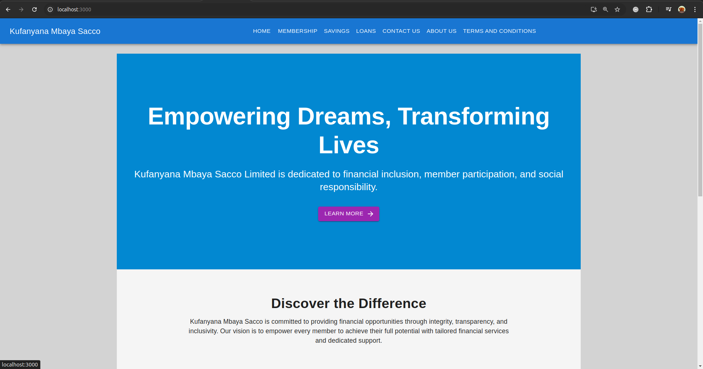

# Kufanyana Mbaya Sacco Limited

## Overview

Kufanyana Mbaya Sacco Limited is a web application designed to provide a platform for members to apply for loans, join the SACCO, and manage their financial activities. This app integrates with a PostgreSQL database to handle member and loan information securely and efficiently.

## Table of Contents

- [Features](#features)
- [Technologies Used](#technologies-used)
- [Installation](#installation)
- [Setup](#setup)
- [Usage](#usage)
- [API Endpoints](#api-endpoints)
- [Contributing](#contributing)
- [License](#license)

## Features

- **Member Management**: View and select members for loan guarantees.
- **Loan Application**: Apply for loans with details including amount and purpose.
- **Join Application**: Apply to become a member of the SACCO.
- **Responsive Design**: The application is optimized for both desktop and mobile views.

## Technologies Used

- **Frontend**:
  - React
  - Material-UI

- **Backend**:
  - Node.js
  - Express
  - PostgreSQL

- **Database**:
  - PostgreSQL

## Installation

### Prerequisites

1. **Node.js**: Ensure you have Node.js installed. You can download it from [nodejs.org](https://nodejs.org/).
2. **PostgreSQL**: Ensure PostgreSQL is installed and running. You can download it from [postgresql.org](https://www.postgresql.org/download/).

### Clone the Repository

```bash
git clone https://github.com/your-repo/kufanyana-mbaya-sacco.git
cd kufanyana-mbaya-sacco
```

### Backend Setup

1. **Navigate to the Backend Directory**:

   ```bash
   cd backend
   ```

2. **Install Dependencies**:

   ```bash
   npm install
   ```

3. **Configure the Database**:

   - Edit `server.js` to ensure the PostgreSQL connection parameters match your database setup.

4. **Start the Server**:

   ```bash
   npm start
   ```

   The backend server will run on `http://localhost:5001`.

### Frontend Setup

1. **Navigate to the Frontend Directory**:

   ```bash
   cd ../frontend
   ```

2. **Install Dependencies**:

   ```bash
   npm install
   ```

3. **Start the Frontend**:

   ```bash
   npm start
   ```

   The frontend will be accessible at `http://localhost:3000`.

## Usage

1. **Viewing Members**: Go to the main page to view and select members for loan guarantees.
2. **Applying for Loans**: Click the "Apply for Loan Now" button to open the loan application form.
3. **Joining the SACCO**: Click the "Join Us Now" button to open the membership application form.

## API Endpoints

### `GET /api/members`

- **Description**: Fetches a list of all members.
- **Response**: A JSON array of member objects.

### `POST /api/apply-loan`

- **Description**: Submits a loan application.
- **Request Body**:
  ```json
  {
    "name": "string",
    "email": "string",
    "phoneNumber": "string",
    "loanAmount": "number",
    "loanPurpose": "string",
    "guarantorId": "number"
  }
  ```
- **Response**: Status message indicating success or failure.

### `POST /api/join`

- **Description**: Submits a join application for new members.
- **Request Body**:
  ```json
  {
    "name": "string",
    "email": "string",
    "phoneNumber": "string",
    "address": "string",
    "occupation": "string"
  }
  ```
- **Response**: Status message indicating success or failure.

## Contributing

Contributions are welcome! Please follow these steps to contribute:

1. Fork the repository.
2. Create a new branch (`git checkout -b feature/YourFeature`).
3. Make your changes.
4. Commit your changes (`git commit -am 'Add new feature'`).
5. Push to the branch (`git push origin feature/YourFeature`).
6. Create a new Pull Request.

## License

This project is licensed under the MIT License - see the [LICENSE](LICENSE) file for details.